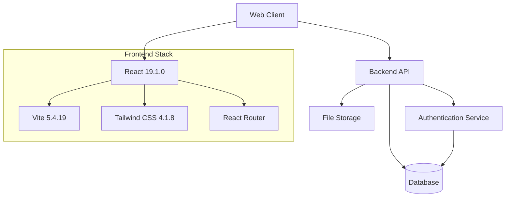
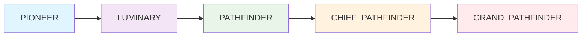
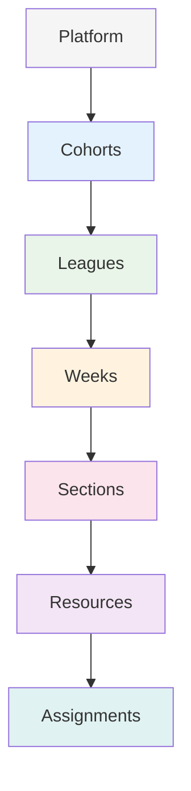
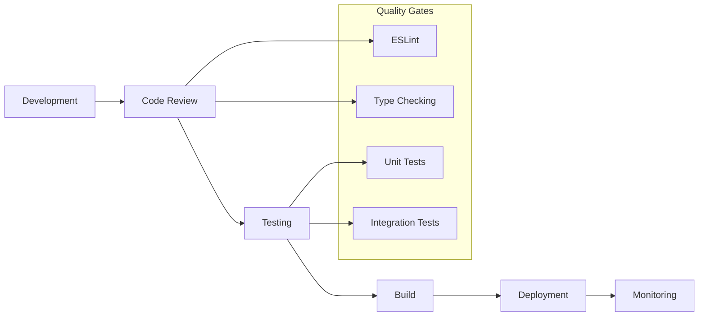
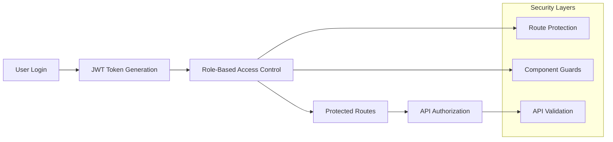
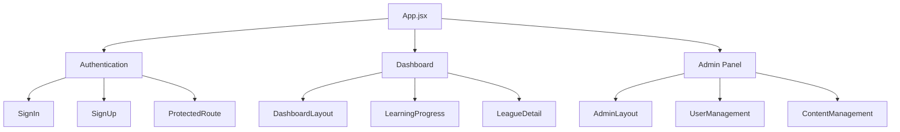
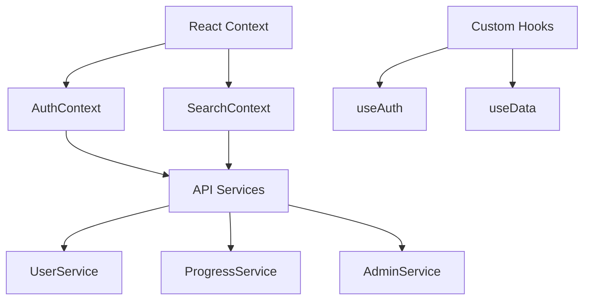
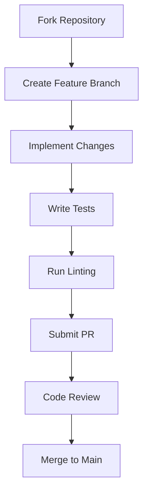
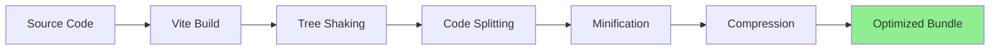

# OpenLearn Platform

A comprehensive learning management system built with React and modern web technologies, featuring role-based education, gamification, and social learning capabilities.

[](https://reactjs.org/)
[](https://vitejs.dev/)
[](https://tailwindcss.com/)
[](https://www.typescriptlang.org/)
[](LICENSE)
[]()
[]()
[]()

## Overview

OpenLearn is a modern educational platform that combines traditional learning management with gamification elements to create an engaging and effective learning experience. The platform features a hierarchical role system, progress tracking, achievement badges, and social sharing capabilities.

### Key Features

- **Role-Based Learning**: Progressive user roles from Pioneer to Grand Pathfinder
- **Structured Content**: Hierarchical organization (Cohorts → Leagues → Weeks → Sections → Resources)
- **Smart Search**: Real-time search across leagues, assignments, and learning content
- **Revision System**: Mark resources for future review with integrated revision tracking
- **Gamification**: Achievement badges, progress tracking, and interactive leaderboards
- **Social Learning**: Share progress, connect with peers, and celebrate achievements
- **Modern Tech Stack**: React 19, Vite, Tailwind CSS, and modern JavaScript
- **Secure Authentication**: JWT-based auth with role-based access control
- **Responsive Design**: Mobile-first approach with adaptive layouts
- **Professional UI**: Modern design with subtle animations and professional aesthetics

## Architecture

### System Architecture Overview



### User Role Hierarchy



### Learning Content Structure



### Technology Stack

[](https://skillicons.dev)

| Component | Technology | Version | Purpose |
|-----------|------------|---------|---------|
| **Frontend Framework** | React | 19.1.0 | Component-based UI development |
| **Build Tool** | Vite | 5.4.19 | Fast development and optimized builds |
| **Styling** | Tailwind CSS | 4.1.8 | Utility-first CSS framework |
| **Routing** | React Router DOM | 7.6.2 | Client-side routing and navigation |
| **Icons** | Lucide React | Latest | Modern icon library |
| **State Management** | React Context API | Built-in | Global state management |
| **Code Quality** | ESLint | 9.25.0 | Code linting and quality assurance |

### Development Workflow



## Quick Start

### Prerequisites


### Installation

```bash
# Clone the repository
git clone <repository-url>
cd openlearn-frontend

# Install dependencies
npm install

# Set up environment variables
cp .env.example .env
# Edit .env with your configuration

# Start development server
npm run dev

# Open in browser
# http://localhost:5173
```

### Available Scripts

```bash
npm run dev          # Start development server with HMR
npm run build        # Build for production
npm run preview      # Preview production build
npm run lint         # Run ESLint code quality checks
```

### Environment Configuration

| Variable | Description | Required | Default |
|----------|-------------|----------|---------|
| `VITE_API_BASE_URL` | Backend API endpoint | Yes | - |
| `VITE_APP_NAME` | Application name | No | OpenLearn |
| `VITE_ENABLE_ANALYTICS` | Enable analytics tracking | No | false |

## Documentation

Comprehensive documentation is available in the [`docs/`](./docs/) directory:

### Architecture & Development
- **[System Overview](./docs/architecture/system-overview.md)** - Platform architecture and design principles
- **[Component Architecture](./docs/architecture/component-architecture.md)** - Component structure and patterns
- **[Development Setup](./docs/development/setup.md)** - Local development environment setup
- **[Data Flow & State Management](./docs/architecture/data-flow.md)** - State management patterns

### User Guides
- **[Getting Started](./docs/user-guide/getting-started.md)** - New user onboarding guide
- **[Dashboard Overview](./docs/user-guide/dashboard-overview.md)** - Understanding the user dashboard
- **[Resource Revision System](./docs/user-guide/revision-system.md)** - Mark and manage resources for review
- **[Learning Progress](./docs/user-guide/learning-progress.md)** - Progress tracking and completion
- **[Achievements & Badges](./docs/user-guide/achievements.md)** - Badge system and social features

### Admin Documentation
- **[Admin Panel Overview](./docs/admin-guide/admin-overview.md)** - Administrative interface guide
- **[User Management](./docs/admin-guide/user-management.md)** - Managing users and roles
- **[Content Management](./docs/admin-guide/content-management.md)** - Creating and managing content
- **[Badge Management](./docs/admin-guide/badge-management.md)** - Achievement system administration

### API Documentation
- **[Authentication APIs](./docs/api/authentication.md)** - Auth endpoints and JWT handling
- **[Learning Progress APIs](./docs/api/learning-progress.md)** - Enrollment and progress tracking
- **[User Management APIs](./docs/api/user-management.md)** - User administration endpoints
- **[Badge System APIs](./docs/api/badge-system.md)** - Achievement and badge management

## Core Features

### Learning Management
- **Enrollment System**: Users enroll in Cohort + League combinations
- **Progress Tracking**: Section-by-section completion monitoring with real-time updates
- **Revision System**: Mark resources for future review with star-based tagging
- **Smart Search**: Comprehensive search functionality across all learning content
- **Personal Notes**: Add reflections and mark sections for revision
- **Resource Management**: Videos, articles, exercises, and assignments with completion tracking
- **Completion Analytics**: Detailed progress insights and statistics with visual indicators

### Gamification System
- **Achievement Badges**: Automatic and manual badge awarding with visual celebrations
- **Progress Milestones**: Visual progress indicators with status messages and animations
- **Interactive Leaderboards**: Table-based competitive tracking with role-based filtering
- **Social Sharing**: Share achievements on Twitter, LinkedIn, Instagram with custom messages
- **Personal Analytics**: Individual learning journey insights with detailed metrics
- **Revision Tracking**: Star-based system for marking and tracking content for review

### Role-Based Access Control
- **Progressive Roles**: Natural advancement through platform hierarchy
- **Permission Management**: Role-based feature access and restrictions
- **Admin Controls**: Comprehensive administrative tools for content and user management
- **Approval Workflow**: New user approval process with status management
- **Multi-layer Security**: Route, UI, and component-level access control

### User Experience
- **Modern UI/UX**: Clean, professional design with subtle animations and micro-interactions
- **Responsive Design**: Optimized for desktop, tablet, and mobile devices with adaptive layouts
- **Smart Search**: Real-time search with instant filtering and result highlighting
- **Accessibility**: WCAG-compliant design considerations with keyboard navigation support
- **Performance**: Optimized loading times, smooth interactions, and efficient state management
- **Interactive Elements**: Hover effects, loading states, and visual feedback throughout the platform

## Security Features

### Authentication & Authorization


- **JWT Authentication**: Secure token-based authentication system
- **Role-Based Authorization**: Granular access control based on user roles
- **Protected Routes**: Route-level security with role verification
- **Secure API Communication**: Encrypted data transmission
- **Token Refresh**: Automatic token renewal for seamless sessions
- **Multi-layer Security**: Route, UI, and component-level access control

## Development

### Project Structure
```
src/
├── components/         # React components organized by feature
│   ├── admin/         # Administrative interface components
│   ├── auth/          # Authentication components
│   ├── common/        # Shared utility components
│   ├── dashboard/     # User dashboard components
│   └── landingPage/   # Public landing page components
├── context/           # React Context providers
├── hooks/             # Custom React hooks
├── pages/             # Page components and routing
├── utils/             # Utility functions and API services
└── App.jsx            # Main application component
```

### Component Architecture


### State Management Architecture


### Component Guidelines
- **Atomic Design**: Reusable, composable component architecture
- **Props-Based Configuration**: Flexible and configurable components
- **Responsive Design**: Mobile-first approach with adaptive layouts
- **Accessibility**: ARIA labels, keyboard navigation, and screen reader support
- **Performance**: Optimized rendering with React best practices

## Design System

### Color Palette
| Purpose | Color | Hex | Usage |
|---------|-------|-----|--------|
| **Primary** | Golden Yellow | `#FFDE59` | Highlights and CTAs |
| **Secondary** | Black | `#000000` | Text and contrast |
| **Success** | Green | `#10B981` | Completions and success states |
| **Warning** | Orange | `#F59E0B` | Warnings and attention |
| **Error** | Red | `#EF4444` | Errors and alerts |

### Typography Hierarchy
- **Headings**: Bold, clear hierarchy with appropriate sizing
- **Body Text**: Readable font sizes with proper line height
- **Interactive Elements**: Clear labeling and visual feedback

### Animation System
- **Subtle Transitions**: Smooth hover effects and state changes
- **Loading States**: Engaging loading animations and skeleton screens
- **Micro-Interactions**: Delightful user interaction feedback

### Responsive Breakpoints
```scss
// Tailwind CSS breakpoints
sm: 640px   // Small devices
md: 768px   // Medium devices  
lg: 1024px  // Large devices
xl: 1280px  // Extra large devices
2xl: 1536px // 2X Extra large devices
```

## Contributing

We welcome contributions to the OpenLearn platform. Please follow these guidelines:

### Development Process


1. **Fork** the repository and create a feature branch
2. **Follow** the established coding standards and component patterns
3. **Test** your changes thoroughly across different devices and browsers
4. **Document** new features and update relevant documentation
5. **Submit** a pull request with clear description of changes

### Coding Standards
- **ES6+ JavaScript**: Modern JavaScript features and syntax
- **React Best Practices**: Functional components, hooks, and proper lifecycle management
- **Tailwind CSS**: Utility-first styling with consistent design patterns
- **ESLint Configuration**: Follow the established linting rules
- **Component Documentation**: Clear prop documentation and usage examples

### Pull Request Guidelines
- Clear, descriptive commit messages following conventional commits
- Reference relevant issues in PR description
- Include screenshots for UI changes
- Ensure all tests pass and linting is clean
- Update documentation as needed

### Code Quality Standards


## Performance

### Optimization Features
- **Code Splitting**: Dynamic imports for efficient bundle loading
- **Lazy Loading**: On-demand component and resource loading
- **Image Optimization**: Responsive images with proper sizing
- **Bundle Analysis**: Regular bundle size monitoring and optimization
- **Caching Strategy**: Efficient API response caching

### Performance Metrics


### Build Optimization


- **Vite Build System**: Fast development server and optimized production builds
- **Tree Shaking**: Elimination of unused code for smaller bundles
- **Asset Optimization**: Minification and compression for production
- **Source Maps**: Debugging support in development environment

## Roadmap

### Planned Enhancements
- **Mobile App**: Native mobile applications for iOS and Android
- **Video Streaming**: Integrated video player with progress tracking
- **Discussion Forums**: Community discussion and Q&A features
- **Advanced Analytics**: Detailed learning analytics and insights
- **Internationalization**: Multi-language support and localization
- **API Integrations**: Third-party service integrations and webhooks

### Community Features
- **Study Groups**: Collaborative learning group formation
- **Peer Mentoring**: Connection between experienced and new learners
- **Events & Webinars**: Live learning events and recorded sessions
- **Certification System**: Formal completion certificates and credentials


## License

This project is licensed under the MIT License - see the [LICENSE](LICENSE) file for details.

## Acknowledgments

- **React Team** for the excellent frontend framework
- **Vite Team** for the lightning-fast build tool
- **Tailwind CSS Team** for the utility-first CSS framework
- **Lucide** for the beautiful icon library
- **Open Source Community** for inspiration and best practices

## Support

### Getting Help
- **Documentation**: Start with our comprehensive [documentation](./docs/)
- **Issues**: Report bugs and request features via GitHub Issues
- **Discussions**: Join community discussions for questions and ideas
- **Contact**: Reach out to the development team for technical support

### Resources
- **[User Guide](./docs/user-guide/)** - Complete user documentation
- **[Admin Guide](./docs/admin-guide/)** - Administrative documentation
- **[API Documentation](./docs/api/)** - Developer API reference
- **[Development Guide](./docs/development/)** - Setup and contribution guidelines

### Contact Information


---

**Built with precision by the OpenLearn Team**

*Empowering learners through technology and community*
