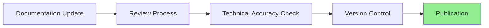

# OpenLearn Platform Documentation

Welcome to the OpenLearn Platform documentation. This directory contains comprehensive guides and references for understanding, using, and developing the OpenLearn educational platform.

## Documentation Structure

```mermaid
graph TB
    Docs[Documentation Root]
    
    Docs --> Arch[Architecture]
    Docs --> API[API Documentation]
    Docs --> User[User Guides]
    Docs --> Admin[Admin Guides]
    Docs --> Dev[Development]
    
    Arch --> SysOver[System Overview]
    Arch --> CompArch[Component Architecture]
    Arch --> DataFlow[Data Flow]
    Arch --> Security[Security]
    
    API --> Auth[Authentication]
    API --> Progress[Learning Progress]
    API --> UserMgmt[User Management]
    API --> Badges[Badge System]
    
    User --> Start[Getting Started]
    User --> Dashboard[Dashboard Overview]
    User --> Revision[Revision System]
    User --> Learning[Learning Progress]
    
    Admin --> Overview[Admin Overview]
    Admin --> Users[User Management]
    Admin --> Content[Content Management]
    Admin --> BadgeMgmt[Badge Management]
    
    Dev --> Setup[Development Setup]
    Dev --> Routing[Dashboard Routing]
    Dev --> Features[Recent Features]
```

### Architecture Documentation
- [System Overview](./architecture/system-overview.md) - Platform architecture and design principles
- [Component Architecture](./architecture/component-architecture.md) - Component structure and patterns
- [Data Flow & State Management](./architecture/data-flow.md) - State management patterns
- [Security Architecture](./architecture/security.md) - Security implementation details

### API Documentation
- [Authentication APIs](./api/authentication.md) - Auth endpoints and JWT handling
- [User Management APIs](./api/user-management.md) - User administration endpoints
- [Learning Progress APIs](./api/learning-progress.md) - Enrollment and progress tracking
- [Badge System APIs](./api/badge-system.md) - Achievement and badge management
- [Admin APIs](./api/admin-apis.md) - Administrative functionality endpoints

### User Guide
- [Getting Started](./user-guide/getting-started.md) - New user onboarding guide
- [Dashboard Overview](./user-guide/dashboard-overview.md) - Understanding the user dashboard
- [Resource Revision System](./user-guide/revision-system.md) - Mark and manage resources for review
- [Learning Progress](./user-guide/learning-progress.md) - Progress tracking and completion
- [Achievements & Badges](./user-guide/achievements.md) - Badge system and social features
- [Social Features](./user-guide/social-features.md) - Community and sharing features
- [Legal Pages](./user-guide/legal-pages.md) - Terms of service and privacy policy

### Admin Guide
- [Admin Panel Overview](./admin-guide/admin-overview.md) - Administrative interface guide
- [User Management](./admin-guide/user-management.md) - Managing users and roles
- [Content Management](./admin-guide/content-management.md) - Creating and managing content
- [Badge Management](./admin-guide/badge-management.md) - Achievement system administration
- [Analytics & Reporting](./admin-guide/analytics.md) - Platform analytics and insights

### Development Guide
- [Development Setup](./development/setup.md) - Local development environment setup
- [Dashboard Routing Implementation](./development/dashboard-routing.md) - Routing architecture
- [Recent Features & Improvements](./development/recent-features.md) - Latest platform updates
- [Coding Standards](./development/coding-standards.md) - Code quality guidelines
- [Component Guidelines](./development/component-guidelines.md) - Component development patterns
- [Testing Guide](./development/testing.md) - Testing strategies and implementation
- [Deployment Guide](./development/deployment.md) - Production deployment procedures

## Quick Navigation

### For New Users
**Start Here**: [Getting Started Guide](./user-guide/getting-started.md)
- Platform registration and setup
- First steps and account activation
- Basic navigation and features

### For Administrators
**Start Here**: [Admin Panel Overview](./admin-guide/admin-overview.md)
- Administrative access and permissions
- User management and content creation
- Platform configuration and maintenance

### For Developers
**Start Here**: [Development Setup](./development/setup.md)
- Local environment configuration
- Project structure and architecture
- Contributing guidelines and standards

### For API Integration
**Start Here**: [API Documentation](./api/)
- Authentication and authorization
- Endpoint references and examples
- Integration patterns and best practices

## Documentation Standards

### Format Guidelines
- **Markdown**: All documentation written in GitHub Flavored Markdown
- **Mermaid Diagrams**: Technical diagrams using Mermaid syntax
- **Code Examples**: Syntax-highlighted code blocks with language specification
- **Screenshots**: High-quality images with clear annotations

### Update Process

### Version Control
- Documentation follows semantic versioning aligned with platform releases
- Major changes documented in changelog with migration guides
- Regular reviews ensure accuracy and completeness

## Support & Resources

### Getting Help
If you can't find what you're looking for in these docs, please:
1. Check the [FAQ section](./user-guide/faq.md) for common questions
2. Review the [troubleshooting guide](./development/troubleshooting.md) for technical issues
3. Submit an issue on GitHub for bug reports or feature requests
4. Contact the development team for urgent technical support

### Contributing to Documentation
To contribute to this documentation:
1. Follow the [documentation standards](./development/documentation-standards.md)
2. Use clear, concise language with proper technical terminology
3. Include relevant code examples and diagrams where appropriate
4. Submit changes via pull request with detailed description
5. Ensure all links and examples are tested and working

### Documentation Metrics

---

**Last Updated**: June 15, 2025  
**Platform Version**: 1.2.0  
**Documentation Version**: Latest

## What's New in v1.2.0

- **Smart Search**: Real-time search across leagues and assignments
- **Revision System**: Star-based resource marking for future review
- **Enhanced Leaderboard**: Table-based design with improved mobile responsiveness
- **Access Control**: Strengthened admin panel security and role restrictions
- **Code Quality**: Comprehensive cleanup and optimization improvements

For a complete list of changes, see the [Changelog](../CHANGELOG.md) and [Recent Features](./development/recent-features.md) documentation.
