# System Overview

High-level architecture and design principles of the OpenLearn Frontend application.

## Architecture Overview

OpenLearn Frontend is a modern React-based single-page application (SPA) built with performance, scalability, and user experience in mind.

```mermaid
graph TB
    User[👤 User] --> Frontend[🌐 React Frontend]
    Frontend --> API[🔌 Backend API]
    API --> Database[🗄️ Database]
    
    subgraph "Frontend Stack"
        React[⚛️ React 19]
        Router[🛣️ React Router]
        Tailwind[🎨 Tailwind CSS]
        Vite[⚡ Vite]
    end
    
    Frontend --> React
    React --> Router
    React --> Tailwind
    React --> Vite
```



## Core Technologies

### Frontend Framework
- **React 19.1.0**: Component-based UI development with latest features
- **React Router DOM 7.6.2**: Client-side routing and navigation
- **Vite 6.3.5**: Fast development server and optimized production builds

### Styling & UI
- **Tailwind CSS 4.1.8**: Utility-first CSS framework
- **Lucide React**: Modern icon library
- **Framer Motion**: Animation library for smooth interactions

### Development Tools
- **ESLint**: Code quality and consistency
- **TypeScript Support**: Type checking and IntelliSense
- **Hot Module Replacement**: Fast development feedback

## Application Architecture

### Component Hierarchy

```mermaid
graph TB
    App[App.jsx] --> AuthProvider[🔐 AuthProvider]
    App --> Router[🛣️ Router]
    
    Router --> Public[🌍 Public Routes]
    Router --> Protected[🔒 Protected Routes]
    Router --> Admin[👑 Admin Routes]
    
    Public --> Landing[🏠 Landing Page]
    Public --> Auth[🔑 Auth Pages]
    
    Protected --> Dashboard[📊 Dashboard]
    Protected --> Leagues[🏆 Leagues]
    Protected --> Profile[👤 Profile]
    
    Admin --> AdminPanel[⚙️ Admin Panel]
    Admin --> UserMgmt[👥 User Management]
    Admin --> ContentMgmt[📝 Content Management]
```



### Data Flow

```mermaid
graph LR
    Components[📱 Components] --> Context[🔄 Context]
    Context --> Services[🔧 Services]
    Services --> API[🌐 API]
    
    API --> Backend[🖥️ Backend]
    Backend --> Database[🗄️ Database]
    
    subgraph "State Management"
        AuthContext[🔐 Auth Context]
        SearchContext[🔍 Search Context]
    end
    
    Context --> AuthContext
    Context --> SearchContext
```



## Project Structure

```
src/
├── 📱 components/          # React components
│   ├── 🔐 auth/           # Authentication components
│   ├── 👑 admin/          # Admin panel components  
│   ├── 📊 dashboard/      # User dashboard components
│   ├── 🏠 landingPage/    # Public landing page
│   └── 🔧 common/         # Shared utility components
├── 📄 pages/              # Route-based page components
├── 🔄 context/            # React Context providers
├── 🪝 hooks/              # Custom React hooks
├── 🔧 utils/              # Utility functions and services
├── 📊 data/               # Static data definitions
├── 🎨 index.css           # Global styles
├── ⚛️ App.jsx             # Main application component
└── 🚀 main.jsx            # Application entry point
```

## Key Features

### Authentication & Authorization
- **JWT-based Authentication**: Secure token-based auth
- **Role-based Access Control**: Multiple user roles and permissions
- **Protected Routes**: Route-level security
- **Token Management**: Automatic refresh and storage

### Learning Management
- **Hierarchical Content**: Cohorts → Leagues → Weeks → Sections → Resources
- **Progress Tracking**: Real-time learning progress
- **Assignment System**: Submission and grading
- **Achievement Badges**: Gamification elements

### User Experience
- **Responsive Design**: Mobile-first approach
- **Modern UI**: Clean, professional interface
- **Smooth Animations**: Micro-interactions and transitions
- **Performance Optimized**: Fast loading and navigation

## Security Architecture

### Authentication Flow


### Access Control

```mermaid
graph TB
    Request[📱 User Request] --> Auth{🔐 Authenticated?}
    Auth -->|No| Login[🔑 Login Page]
    Auth -->|Yes| Role{👤 Role Check}
    
    Role -->|Pioneer| UserRoutes[📊 User Routes]
    Role -->|Admin| AdminRoutes[👑 Admin Routes]
    Role -->|Pathfinder| ExtendedRoutes[🏆 Extended Routes]
    
    UserRoutes --> Dashboard[📊 Dashboard]
    AdminRoutes --> AdminPanel[⚙️ Admin Panel]
    ExtendedRoutes --> AllFeatures[🌟 All Features]
```



## Performance Considerations

### Build Optimization
- **Code Splitting**: Separate vendor and utility chunks
- **Tree Shaking**: Remove unused code
- **Asset Optimization**: Minification and compression
- **Caching Strategy**: Efficient browser caching

### Runtime Performance
- **React Optimization**: Proper component memoization
- **Lazy Loading**: On-demand component loading
- **API Caching**: Intelligent response caching
- **Image Optimization**: Responsive images

## Scalability Features

### Component Reusability
- **Atomic Design**: Reusable component patterns
- **Design System**: Consistent UI components
- **Prop-based Configuration**: Flexible components

### State Management
- **Context API**: Centralized state management
- **Custom Hooks**: Reusable stateful logic
- **Service Layer**: Clean separation of concerns

## Development Workflow

### Local Development

```mermaid
graph LR
    Code[💻 Write Code] --> HMR[⚡ Hot Reload]
    HMR --> Test[🧪 Test Changes]
    Test --> Lint[📝 ESLint Check]
    Lint --> Build[🏗️ Build Verification]
```


### Deployment Pipeline

```mermaid
graph LR
    Push[📤 Git Push] --> CI[🔄 CI/CD]
    CI --> Test[🧪 Run Tests]
    Test --> Build[🏗️ Build App]
    Build --> Deploy[🚀 Deploy]
    Deploy --> Monitor[📊 Monitor]
```


## Next Steps

- **[Component Structure](./components.md)** - Detailed component architecture
- **[State Management](./state-management.md)** - State and context patterns
- **[Security](./security.md)** - Security implementation details
- **[Development Setup](../development/setup.md)** - Development environment setup
