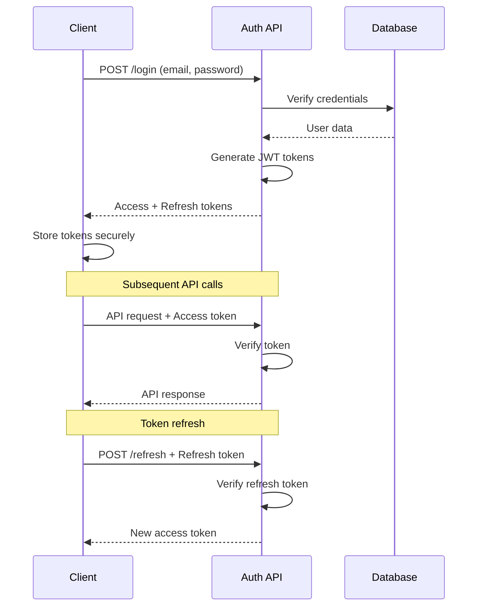

# Security Architecture

This document outlines the security measures, authentication mechanisms, and protection strategies implemented in the OpenLearn platform.

## 🔐 Security Overview

OpenLearn implements a multi-layered security approach that includes authentication, authorization, data protection, and secure communication protocols.

### Security Principles
- **Defense in Depth**: Multiple security layers
- **Least Privilege**: Minimal necessary permissions
- **Zero Trust**: Verify every request
- **Data Protection**: Encryption and secure storage
- **Audit Trail**: Comprehensive logging

## 🚪 Authentication System

### JWT-Based Authentication
The platform uses JSON Web Tokens (JWT) for stateless authentication with a two-token approach:

#### Access Token
- **Purpose**: API authentication
- **Lifetime**: 15 minutes
- **Storage**: Memory only (not localStorage)
- **Claims**: User ID, role, permissions

#### Refresh Token
- **Purpose**: Access token renewal
- **Lifetime**: 7 days
- **Storage**: Secure httpOnly cookie (recommended) or localStorage
- **Claims**: User ID, token version

### Token Structure
```javascript
// Access Token Payload
{
  "sub": "user_123",
  "email": "user@example.com",
  "role": "PIONEER",
  "permissions": ["read:profile", "write:progress"],
  "iat": 1623456789,
  "exp": 1623457689,
  "iss": "openlearn-api"
}

// Refresh Token Payload
{
  "sub": "user_123",
  "tokenVersion": 1,
  "iat": 1623456789,
  "exp": 1624061589,
  "iss": "openlearn-api"
}
```

### Authentication Flow


## 🛡️ Authorization System

### Role-Based Access Control (RBAC)

#### Role Hierarchy
```
GRAND_PATHFINDER (Level 5)
    ├── All platform permissions
    └── User role management
        
CHIEF_PATHFINDER (Level 4)
    ├── Limited admin access
    ├── User approval/management
    └── Content management
        
PATHFINDER (Level 3)
    ├── Advanced features
    ├── Peer mentoring
    └── Enhanced analytics
        
LUMINARY (Level 2)
    ├── Social features
    ├── Advanced progress tracking
    └── Community participation
        
PIONEER (Level 1)
    ├── Basic platform access
    ├── Course enrollment
    └── Progress tracking
```

#### Permission System
```javascript
const PERMISSIONS = {
  // User permissions
  'read:profile': ['PIONEER', 'LUMINARY', 'PATHFINDER', 'CHIEF_PATHFINDER', 'GRAND_PATHFINDER'],
  'write:profile': ['PIONEER', 'LUMINARY', 'PATHFINDER', 'CHIEF_PATHFINDER', 'GRAND_PATHFINDER'],
  
  // Progress permissions
  'read:progress': ['PIONEER', 'LUMINARY', 'PATHFINDER', 'CHIEF_PATHFINDER', 'GRAND_PATHFINDER'],
  'write:progress': ['PIONEER', 'LUMINARY', 'PATHFINDER', 'CHIEF_PATHFINDER', 'GRAND_PATHFINDER'],
  
  // Admin permissions
  'read:admin': ['CHIEF_PATHFINDER', 'GRAND_PATHFINDER'],
  'write:admin': ['GRAND_PATHFINDER'],
  'manage:users': ['CHIEF_PATHFINDER', 'GRAND_PATHFINDER'],
  'manage:content': ['CHIEF_PATHFINDER', 'GRAND_PATHFINDER'],
  'manage:system': ['GRAND_PATHFINDER']
};
```

### Protected Route Implementation
```javascript
// Route protection middleware
const ProtectedRoute = ({ requiredRoles = [], children }) => {
  const { user, isAuthenticated, hasRole } = useAuth();
  
  if (!isAuthenticated()) {
    return <Navigate to="/signin" replace />;
  }
  
  if (requiredRoles.length > 0 && !hasRole(requiredRoles)) {
    return <UnauthorizedAccess />;
  }
  
  return children;
};

// Usage
<ProtectedRoute requiredRoles={['CHIEF_PATHFINDER', 'GRAND_PATHFINDER']}>
  <AdminPanel />
</ProtectedRoute>
```

### API Route Protection
```javascript
// Backend middleware example
const requireAuth = (req, res, next) => {
  const token = req.headers.authorization?.split(' ')[1];
  
  if (!token) {
    return res.status(401).json({ error: 'No token provided' });
  }
  
  try {
    const decoded = jwt.verify(token, process.env.JWT_SECRET);
    req.user = decoded;
    next();
  } catch (error) {
    return res.status(401).json({ error: 'Invalid token' });
  }
};

const requireRole = (roles) => (req, res, next) => {
  if (!roles.includes(req.user.role)) {
    return res.status(403).json({ error: 'Insufficient permissions' });
  }
  next();
};
```

## 🔒 Data Protection

### Input Validation
```javascript
// Frontend validation
const validateUserInput = (data) => {
  const errors = {};
  
  // Email validation
  if (!data.email || !/^[^\s@]+@[^\s@]+\.[^\s@]+$/.test(data.email)) {
    errors.email = 'Valid email is required';
  }
  
  // Password validation
  if (!data.password || data.password.length < 8) {
    errors.password = 'Password must be at least 8 characters';
  }
  
  // XSS protection
  const sanitized = {
    ...data,
    name: DOMPurify.sanitize(data.name),
    bio: DOMPurify.sanitize(data.bio)
  };
  
  return { errors, sanitized };
};
```

### SQL Injection Prevention
```javascript
// Parameterized queries (backend)
const getUserByEmail = async (email) => {
  const query = 'SELECT * FROM users WHERE email = $1';
  const result = await pool.query(query, [email]);
  return result.rows[0];
};
```

### XSS Protection
```javascript
// Content Security Policy
const CSP_HEADER = {
  'Content-Security-Policy': [
    "default-src 'self'",
    "script-src 'self' 'unsafe-inline'",
    "style-src 'self' 'unsafe-inline' https://fonts.googleapis.com",
    "font-src 'self' https://fonts.gstatic.com",
    "img-src 'self' data: https:",
    "connect-src 'self' https://api.openlearn.com"
  ].join('; ')
};

// HTML sanitization
import DOMPurify from 'dompurify';

const SafeHTML = ({ content }) => {
  const sanitized = DOMPurify.sanitize(content);
  return <div dangerouslySetInnerHTML={{ __html: sanitized }} />;
};
```

## 🌐 Secure Communication

### HTTPS Enforcement
```javascript
// Force HTTPS in production
if (process.env.NODE_ENV === 'production' && !req.secure) {
  return res.redirect(301, `https://${req.headers.host}${req.url}`);
}
```

### API Security Headers
```javascript
const securityHeaders = {
  'X-Content-Type-Options': 'nosniff',
  'X-Frame-Options': 'DENY',
  'X-XSS-Protection': '1; mode=block',
  'Referrer-Policy': 'strict-origin-when-cross-origin',
  'Permissions-Policy': 'camera=(), microphone=(), geolocation=()'
};
```

### CORS Configuration
```javascript
const corsOptions = {
  origin: (origin, callback) => {
    const allowedOrigins = [
      'https://openlearn.com',
      'https://app.openlearn.com',
      ...(process.env.NODE_ENV === 'development' ? ['http://localhost:5173'] : [])
    ];
    
    if (!origin || allowedOrigins.includes(origin)) {
      callback(null, true);
    } else {
      callback(new Error('Not allowed by CORS'));
    }
  },
  credentials: true,
  optionsSuccessStatus: 200
};
```

## 🔐 Password Security

### Password Requirements
```javascript
const PASSWORD_REQUIREMENTS = {
  minLength: 8,
  requireUppercase: true,
  requireLowercase: true,
  requireNumbers: true,
  requireSpecialChars: false,
  prohibitCommonPasswords: true
};

const validatePassword = (password) => {
  const errors = [];
  
  if (password.length < PASSWORD_REQUIREMENTS.minLength) {
    errors.push(`Password must be at least ${PASSWORD_REQUIREMENTS.minLength} characters`);
  }
  
  if (PASSWORD_REQUIREMENTS.requireUppercase && !/[A-Z]/.test(password)) {
    errors.push('Password must contain at least one uppercase letter');
  }
  
  if (PASSWORD_REQUIREMENTS.requireLowercase && !/[a-z]/.test(password)) {
    errors.push('Password must contain at least one lowercase letter');
  }
  
  if (PASSWORD_REQUIREMENTS.requireNumbers && !/\d/.test(password)) {
    errors.push('Password must contain at least one number');
  }
  
  return errors;
};
```

### Password Hashing (Backend)
```javascript
const bcrypt = require('bcrypt');

const hashPassword = async (password) => {
  const saltRounds = 12;
  return await bcrypt.hash(password, saltRounds);
};

const verifyPassword = async (password, hash) => {
  return await bcrypt.compare(password, hash);
};
```

## 🕵️ Security Monitoring

### Rate Limiting
```javascript
// API rate limiting
const rateLimit = require('express-rate-limit');

const authLimiter = rateLimit({
  windowMs: 15 * 60 * 1000, // 15 minutes
  max: 5, // 5 attempts per window
  message: 'Too many login attempts, please try again later',
  standardHeaders: true,
  legacyHeaders: false
});

const apiLimiter = rateLimit({
  windowMs: 15 * 60 * 1000,
  max: 100, // 100 requests per window
  message: 'Too many requests, please try again later'
});
```

### Security Logging
```javascript
const securityLogger = {
  logFailedLogin: (email, ip, userAgent) => {
    console.log({
      event: 'FAILED_LOGIN',
      email,
      ip,
      userAgent,
      timestamp: new Date().toISOString()
    });
  },
  
  logSuspiciousActivity: (userId, activity, details) => {
    console.log({
      event: 'SUSPICIOUS_ACTIVITY',
      userId,
      activity,
      details,
      timestamp: new Date().toISOString()
    });
  },
  
  logUnauthorizedAccess: (userId, resource, ip) => {
    console.log({
      event: 'UNAUTHORIZED_ACCESS',
      userId,
      resource,
      ip,
      timestamp: new Date().toISOString()
    });
  }
};
```

### Session Management
```javascript
const SESSION_CONFIG = {
  maxAge: 15 * 60 * 1000, // 15 minutes
  checkPeriod: 5 * 60 * 1000, // Check every 5 minutes
  maxConcurrentSessions: 3
};

// Session cleanup
const cleanupExpiredSessions = () => {
  const now = Date.now();
  activeSessions.forEach((session, sessionId) => {
    if (now - session.lastActivity > SESSION_CONFIG.maxAge) {
      activeSessions.delete(sessionId);
    }
  });
};

setInterval(cleanupExpiredSessions, SESSION_CONFIG.checkPeriod);
```

## 🔍 Vulnerability Prevention

### Common Security Threats

#### 1. Cross-Site Scripting (XSS)
```javascript
// Prevention measures
- Content Security Policy (CSP) headers
- Input sanitization with DOMPurify
- React's built-in XSS protection
- Escape user-generated content
```

#### 2. Cross-Site Request Forgery (CSRF)
```javascript
// CSRF token implementation
const csrfToken = crypto.randomBytes(32).toString('hex');

// Include in forms
<input type="hidden" name="csrfToken" value={csrfToken} />

// Verify on backend
if (req.body.csrfToken !== req.session.csrfToken) {
  return res.status(403).json({ error: 'CSRF token mismatch' });
}
```

#### 3. SQL Injection
```javascript
// Use parameterized queries
const query = 'SELECT * FROM users WHERE id = $1 AND status = $2';
const result = await pool.query(query, [userId, 'ACTIVE']);
```

#### 4. Insecure Direct Object References
```javascript
// Authorization checks
const checkResourceAccess = async (userId, resourceId) => {
  const resource = await getResource(resourceId);
  
  if (!resource) {
    throw new Error('Resource not found');
  }
  
  if (resource.ownerId !== userId && !hasAdminRole(userId)) {
    throw new Error('Access denied');
  }
  
  return resource;
};
```

## 🚨 Incident Response

### Security Incident Classification
- **P0 - Critical**: Data breach, system compromise
- **P1 - High**: Authentication bypass, privilege escalation
- **P2 - Medium**: Information disclosure, denial of service
- **P3 - Low**: Configuration issues, minor vulnerabilities

### Response Procedures
1. **Detection**: Automated monitoring and manual reporting
2. **Assessment**: Determine severity and impact
3. **Containment**: Isolate affected systems
4. **Investigation**: Root cause analysis
5. **Recovery**: Restore normal operations
6. **Post-Incident**: Review and improve security measures

### Emergency Contacts
```javascript
const SECURITY_CONTACTS = {
  securityTeam: 'security@openlearn.com',
  incidentResponse: 'incident@openlearn.com',
  emergencyPhone: '+1-xxx-xxx-xxxx'
};
```

## 🔐 Security Checklist

### Development Security Checklist
- [ ] Input validation on all user inputs
- [ ] SQL injection prevention with parameterized queries
- [ ] XSS prevention with content sanitization
- [ ] CSRF protection with tokens
- [ ] Secure authentication with JWT
- [ ] Role-based authorization implemented
- [ ] HTTPS enforced in production
- [ ] Security headers configured
- [ ] Rate limiting implemented
- [ ] Error messages don't leak sensitive information
- [ ] Dependencies regularly updated
- [ ] Security logging implemented

### Deployment Security Checklist
- [ ] Environment variables secured
- [ ] Database access restricted
- [ ] API endpoints documented and secured
- [ ] Backup encryption enabled
- [ ] Monitoring and alerting configured
- [ ] Security scanning automated
- [ ] Penetration testing completed
- [ ] Incident response plan in place

This security architecture documentation provides comprehensive coverage of all security measures implemented in the OpenLearn platform.
