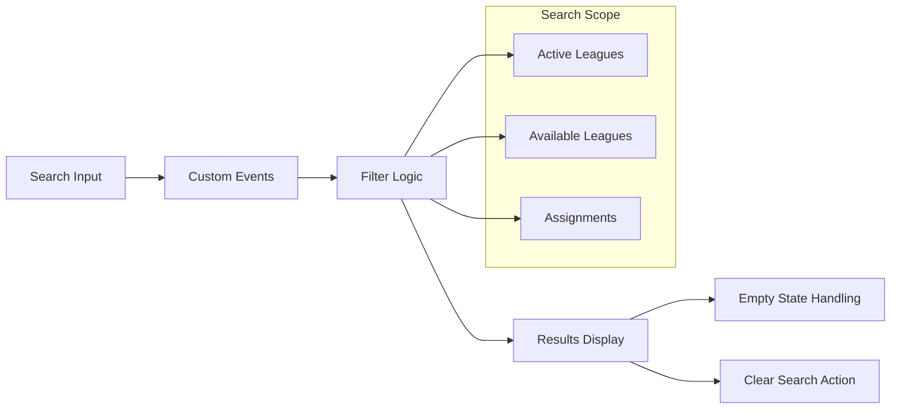
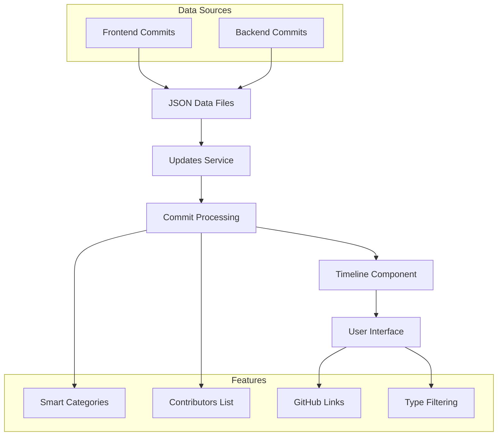

# Recent Features & Improvements

This document outlines the latest features and improvements implemented in the OpenLearn Platform as of June 2025.

[]()
[]()
[]()

## Dashboard Search Functionality

### Feature Architecture


### Overview
A comprehensive search system that allows users to quickly find leagues, assignments, and learning content across their dashboard.

### Features
- **Real-time Filtering**: Instant search results as you type
- **Cross-Component Search**: Search works across active leagues and available learning paths
- **Smart Result Handling**: Clear indicators when search yields no results
- **Quick Clear**: Easy-to-access clear search functionality

### Implementation Details
- **Event-driven Architecture**: Custom events for cross-component communication
- **Search Context**: Lightweight context management for search state
- **Performance Optimized**: Minimal re-renders and efficient filtering

### Usage
1. Navigate to your dashboard
2. Use the search bar in the header to type your query
3. Results filter in real-time across all leagues and assignments
4. Click "Clear search" or use the X button to reset

---

## 📝 Resource Revision System

### Overview
A star-based system for marking learning resources that need future review or revision.

### Features
- **Visual Indicators**: Star icons clearly show revision status
- **One-Click Marking**: Easy toggle between marked and unmarked states
- **Persistent Storage**: Revision status saved across sessions
- **Integration**: Seamlessly integrated into the resource table

### Implementation Details
- **API Integration**: RESTful endpoints for revision status management
- **Real-time Updates**: Immediate visual feedback on status changes
- **Error Handling**: Robust error handling with user-friendly messages

### Usage
1. Navigate to any league detail page
2. Find the resource you want to mark for revision
3. Click the star icon in the "Revision" column
4. The star fills to indicate the resource is marked for future review
5. Click again to unmark

---

## 🏆 Enhanced Leaderboard

### Overview
A complete redesign of the leaderboard from card-based to table-based layout with improved functionality.

### Features
- **Table Layout**: Clean, organized presentation of leaderboard data
- **Role-based Filtering**: Shows only PIONEER and LUMINARY users
- **Proper Ranking**: Consecutive ranks after filtering (1, 2, 3, etc.)
- **Mobile Responsive**: Adapts gracefully to smaller screens
- **Rich Data Display**: Shows progress bars, badges, and recent activity

### Implementation Details
- **Rank Recalculation**: Proper rank assignment after role filtering
- **Responsive Design**: Mobile-first approach with adaptive columns
- **Performance**: Efficient data processing and rendering

### Data Displayed
- **Rank**: Position in leaderboard (1st, 2nd, 3rd, etc.)
- **Student Info**: Name, avatar, and ID
- **Role**: Visual role badges (Pioneer/Luminary)
- **Resources**: Completion count (completed/total)
- **Progress**: Percentage and visual progress bar
- **Badges**: Total badges earned
- **Recent Activity**: Last completed resource and timestamp

---

## 🔐 Admin Access Control Improvements

### Overview
Enhanced role-based access control for administrative features, particularly for specialized management functions.

### Features
- **Multi-layer Security**: Route, UI, and component-level access control
- **Role Restrictions**: SpecializationManagement restricted to GRAND_PATHFINDER only
- **Clear Feedback**: Appropriate messages when access is denied
- **Graceful Degradation**: Features hide/show based on user permissions

### Implementation Details
- **Route Protection**: Protected routes that redirect unauthorized users
- **Component Visibility**: Conditional rendering based on user roles
- **Service Layer**: Backend validation of user permissions

### Access Levels
- **GRAND_PATHFINDER**: Full admin access including specialization management
- **CHIEF_PATHFINDER**: Standard admin access excluding specialized features
- **PATHFINDER+**: Limited admin features based on specific permissions

---

## 🧹 Code Quality Improvements

### Overview
Comprehensive cleanup and optimization of the codebase for better maintainability and performance.

### Improvements Made
- **Removed Unused Components**: Eliminated redundant `SectionProgress.jsx` and `ResourceCard.jsx`
- **Import Optimization**: Cleaned up unused imports and dependencies
- **Console Cleanup**: Removed debug console.log statements
- **File Organization**: Proper file extensions and structure

### Benefits
- **Reduced Bundle Size**: Smaller application bundles for faster loading
- **Improved Maintainability**: Cleaner codebase easier to understand and modify
- **Better Performance**: Optimized imports and reduced unnecessary re-renders
- **Enhanced Developer Experience**: Cleaner development console and better debugging

---

## 🎨 UI/UX Enhancements

### Overview
Various user interface and experience improvements for better usability and visual appeal.

### Improvements
- **Enhanced Resource Tables**: Better grid layout and responsive design
- **Improved Loading States**: More intuitive loading indicators and skeleton screens
- **Visual Feedback**: Better hover effects and interaction feedback
- **Mobile Optimization**: Enhanced mobile experience across all components

### Technical Implementation
- **CSS Grid**: Modern layout techniques for better responsiveness
- **Animation Improvements**: Smoother transitions and micro-interactions
- **Accessibility**: Better keyboard navigation and screen reader support
- **Performance**: Optimized rendering and reduced layout shifts

---

## 🚀 Technical Improvements

### Architecture Enhancements
- **Event-driven Search**: More efficient cross-component communication
- **API Integration**: Better error handling and status management
- **State Management**: Optimized local state handling for better performance
- **Component Structure**: Improved component composition and reusability

### Performance Optimizations
- **Reduced API Calls**: More efficient data fetching strategies
- **Optimized Rendering**: Reduced unnecessary re-renders
- **Bundle Optimization**: Cleaner imports and dead code elimination
- **Caching Strategy**: Better data persistence and retrieval

### Development Experience
- **Better Error Handling**: More informative error messages and recovery
- **Improved Debugging**: Cleaner console output and better development tools
- **Code Organization**: Better file structure and component organization
- **Documentation**: Enhanced inline documentation and code comments

---

## 📱 Mobile Experience

### Responsive Design Improvements
- **Adaptive Layouts**: Components that work seamlessly across all screen sizes
- **Touch Optimization**: Better touch targets and gesture support
- **Performance**: Optimized for mobile performance and battery life
- **Accessibility**: Enhanced mobile accessibility features

### Mobile-Specific Features
- **Swipe Interactions**: Intuitive mobile navigation patterns
- **Optimized Typography**: Better readability on small screens
- **Efficient Loading**: Progressive loading for mobile networks
- **Offline Capability**: Basic offline functionality for improved experience

---

## � Platform Updates Page

### Feature Architecture


### Overview
A comprehensive platform updates page that displays real-time development activity from both frontend and backend repositories in an intuitive timeline format.

### Features
- **Dual Repository Support**: Displays commits from both openlearn-frontend and openlearn-backend
- **Smart Categorization**: Automatically categorizes commits by type (feature, fix, docs, etc.)
- **Repository Tagging**: Visual distinction between frontend (blue) and backend (green) commits
- **Contributors Section**: Shows all unique contributors with GitHub profile links
- **Chronological Timeline**: Latest commits appear first with detailed timestamps
- **Interactive Elements**: Clickable commit hashes linking to GitHub commits
- **Responsive Design**: Works seamlessly across all device sizes

### Implementation Details
- **JSON Data Architecture**: Separate JSON files for frontend and backend commits
- **Service Layer**: Clean separation with updatesService.js for data processing
- **Efficient Sorting**: Timestamp-based sorting for accurate chronological order
- **GitHub Integration**: Direct links to commits and contributor profiles
- **Performance Optimized**: Pagination with load-more functionality

### Technical Specifications
```javascript
// Data Structure
{
  "hash": "317dc87",
  "date": "2025-07-08", 
  "time": "1751963314",
  "author": "chahatkesh",
  "message": "fix: remove unused ResourceIcon prop",
  "repo": "frontend"
}

// Processed Output
{
  "type": "fix",
  "category": "UI Components", 
  "summary": "Remove unused ResourceIcon prop",
  "commitHash": "317dc87",
  "repo": "frontend",
  "timestamp": 1751963314
}
```

### Usage
1. Navigate to `/updates` in the application
2. View comprehensive timeline of all development activity
3. Click commit hashes to view full changes on GitHub
4. Explore contributor profiles and their contributions
5. Use pagination to browse historical commits

### Category System
- **DevOps**: Deployment, CI/CD, Docker configurations
- **Database**: Prisma, schema changes, migrations
- **Authentication**: Login, permissions, security features
- **UI Components**: React components, modals, layouts
- **Backend API**: Endpoints, controllers, services
- **Documentation**: README updates, guides, comments
- **Code Quality**: Refactoring, optimization, cleanup

---

## �🔮 Future Enhancements

### Planned Features
- **Advanced Search**: Semantic search capabilities with content indexing
- **Bulk Actions**: Multi-select operations for resource management
- **Keyboard Shortcuts**: Power user shortcuts for efficient navigation
- **Personalization**: Customizable dashboard layouts and preferences

### Technical Roadmap
- **API Optimization**: GraphQL integration for more efficient data fetching
- **Real-time Features**: WebSocket integration for live updates
- **Performance**: Further bundle size optimization and lazy loading
- **Internationalization**: Multi-language support preparation

---

**Last Updated**: June 15, 2025  
**Version**: 1.2.0  
**Contributors**: OpenLearn Development Team
