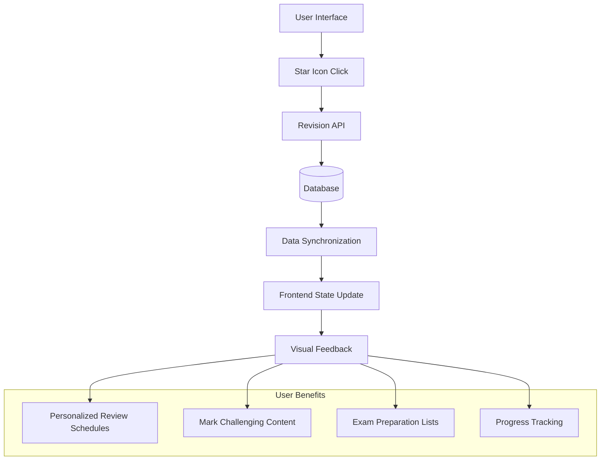

# Resource Revision System

The Resource Revision System allows learners to mark learning resources for future review, creating a personalized study plan based on their individual needs.

[]()
[]()
[]()

## Overview

The revision system uses a star-based interface to let users flag resources they want to revisit later. This feature helps learners:

### Revision System Architecture


- Create personalized review schedules
- Mark challenging content for additional study
- Build custom revision lists for exam preparation
- Track resources that need more attention

## ⭐ How It Works

### Visual Interface
- **Star Icon**: Appears in the "Revision" column of resource tables
- **Empty Star**: Resource not marked for revision
- **Filled Star**: Resource marked for revision (orange color)
- **Hover Effects**: Visual feedback on interaction

### User Actions
1. **Mark for Revision**: Click empty star to mark a resource
2. **Unmark for Revision**: Click filled star to remove revision marking
3. **Visual Feedback**: Immediate visual confirmation of action
4. **Success Messages**: Toast notifications confirm the action

## 🔧 Technical Implementation

### Frontend Features
- **Real-time Updates**: Changes appear immediately without page refresh
- **Error Handling**: Graceful error handling with user-friendly messages
- **Loading States**: Visual indicators during API requests
- **Persistent State**: Revision status maintained across sessions

### Backend Integration
- **RESTful API**: Standard HTTP endpoints for revision management
- **Data Persistence**: Revision status stored in user progress records
- **Synchronization**: Changes synchronized across all user sessions

### API Endpoints
```
POST /api/resources/{resourceId}/mark-revision
DELETE /api/resources/{resourceId}/mark-revision
GET /api/user/revision-list
```

## 📱 User Experience

### Finding the Feature
1. Navigate to any league detail page
2. Scroll to the resource table for any week/section
3. Look for the "Revision" column (star icon header)
4. Click any star to mark/unmark resources

### Mobile Experience
- **Touch-friendly**: Large enough touch targets for mobile devices
- **Responsive**: Adapts to different screen sizes
- **Fast Response**: Optimized for mobile network conditions

### Accessibility
- **Keyboard Navigation**: Full keyboard accessibility support
- **Screen Readers**: Proper ARIA labels and descriptions
- **Visual Contrast**: High contrast for visibility
- **Focus Indicators**: Clear focus states for navigation

## 🎯 Use Cases

### Study Planning
- Mark complex topics for additional review
- Create custom study schedules before assessments
- Flag resources with important reference material
- Build personalized learning paths

### Progress Tracking
- Identify areas that need more attention
- Track improvement over time on challenging topics
- Create revision checklists for course completion
- Monitor personal learning patterns

### Collaboration
- Share revision lists with study groups (future feature)
- Create collaborative study plans (future feature)
- Instructor insights into common challenging topics (future feature)

## 🚀 Future Enhancements

### Planned Features
- **Revision Dashboard**: Dedicated page for managing marked resources
- **Smart Scheduling**: AI-powered revision scheduling based on user patterns
- **Bulk Actions**: Mark multiple resources at once
- **Export Options**: Export revision lists for offline study

### Advanced Features
- **Spaced Repetition**: Intelligent timing for revision reminders
- **Progress Analytics**: Track revision effectiveness over time
- **Integration**: Connect with calendar apps for study scheduling
- **Recommendations**: Suggest resources for revision based on performance

## 📊 Analytics & Insights

### User Analytics
- **Most Revised Topics**: Identify commonly challenging content
- **Revision Patterns**: Track when and how often users review content
- **Success Metrics**: Measure improvement after revision
- **Engagement Data**: Monitor feature usage and effectiveness

### Content Analytics
- **Popular Revisions**: Resources most frequently marked for revision
- **Difficulty Indicators**: Identify challenging content across users
- **Content Optimization**: Data-driven content improvement suggestions
- **Learning Path Insights**: Optimize learning sequences based on revision data

## 🛠️ Implementation Guide

### For Developers
```javascript
// Mark resource for revision
const markForRevision = async (resourceId) => {
  try {
    await ResourceProgressService.markResourceForRevision(resourceId);
    // Update local state
    updateResourceProgress(resourceId, { markedForRevision: true });
  } catch (error) {
    console.error('Failed to mark resource for revision:', error);
  }
};

// Check if resource is marked for revision
const isMarkedForRevision = (resourceProgress) => {
  return resourceProgress?.markedForRevision || false;
};
```

### Database Schema
```sql
-- User resource progress table
ALTER TABLE user_resource_progress 
ADD COLUMN marked_for_revision BOOLEAN DEFAULT FALSE;
ADD COLUMN revision_marked_at TIMESTAMP NULL;
ADD COLUMN revision_count INTEGER DEFAULT 0;
```

## 📋 Best Practices

### For Users
- **Strategic Marking**: Mark resources that genuinely need review, not every resource
- **Regular Review**: Check your marked resources periodically
- **Unmark When Done**: Remove revision marks once you've mastered the content
- **Balance**: Use alongside other study methods, not as the only review system

### For Administrators
- **Monitor Usage**: Track which content is most frequently marked for revision
- **Content Review**: Use revision data to identify content that may need improvement
- **User Support**: Help users understand effective revision strategies
- **Feature Evolution**: Gather feedback for future enhancement planning

---

**Feature Status**: ✅ Live  
**Last Updated**: June 15, 2025  
**Version**: 1.2.0  
**Supported Platforms**: Web (Mobile & Desktop)
